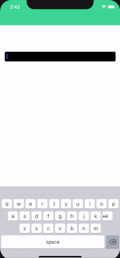

# iOS Weather ML Keyboard

iOS Keyboard extension with temperature prediction.


## Includes

* iOS 13 Style Keyboard light/dark, QWERTY, ready to be duplicated to other project.
* ML Model with weather prediction.
* iOS Keyboard extension.
* Autocomplete iSO 13 style for weather prediction.
* No internet needed & Works offline.

## Getting Started

```pod install``` and build. Type some letters.

## Built With

* [Prophet](https://facebook.github.io/prophet/)
* [SwiftCSV](https://github.com/swiftcsv/SwiftCSV)
* jena_climate_2009_2016

## Authors

* **Bliss Wetch**

## Acknowledgments

* [SeldonIO/alibi-detect](https://github.com/SeldonIO/alibi-detect/blob/169b28a39757524f09dc72a63d27a2c927a2822a/examples/od_prophet_weather.ipynb)
* [Custom Keyboard Extensions: Getting Started/Eric Cerney](https://www.raywenderlich.com/49-custom-keyboard-extensions-getting-started)
